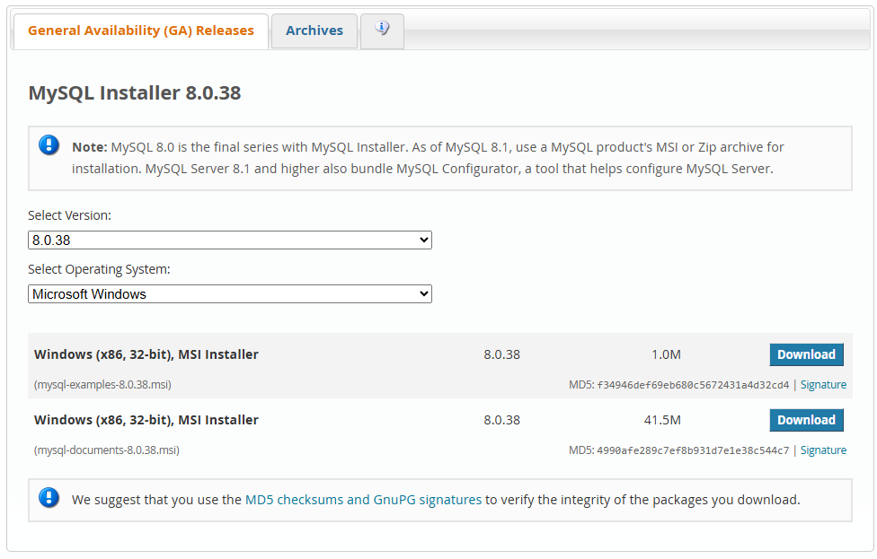
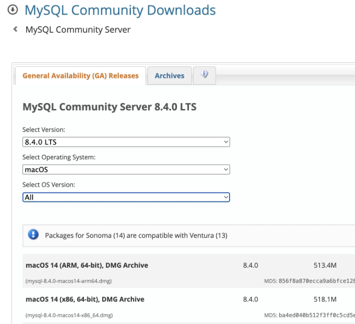
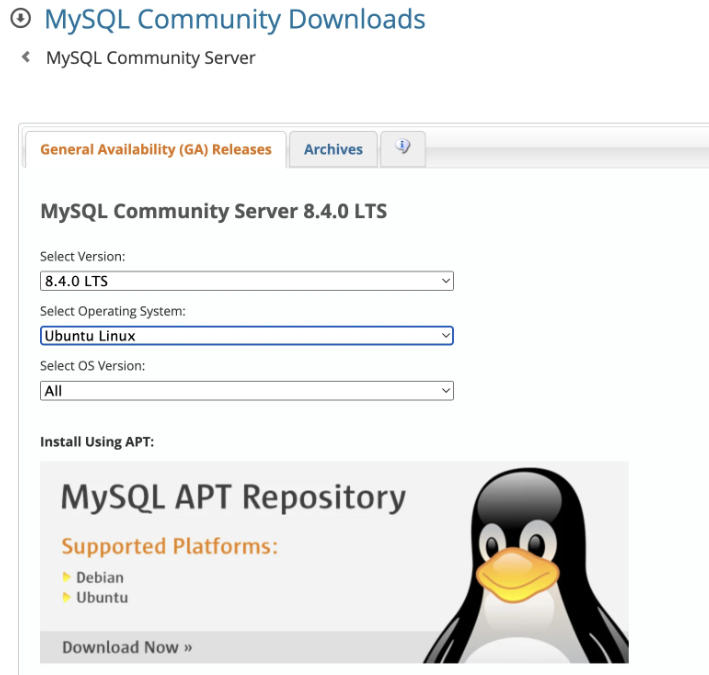

# Instalación de MySQL Server y MySQL Workbench

Antes de dar tus primeros pasos en el mundo de los datos a un nivel más avanzado, es fundamental instalar un motor de base de datos en tu computadora. En este caso, utilizaremos MySQL Server y MySQL Workbench.

No necesitas conocimientos previos para seguir estas instrucciones. ¡Vamos a empezar!

## Requisitos previos

Antes de comenzar, asegúrate de tener:

* Una conexión a internet.
* Permisos de administrador en tu computadora.

## Instalación de MySQL Server

### Windows



1. **Descargar MySQL Installer**:

    * Ve a la página de descargas de MySQL: [MySQL Downloads](https://dev.mysql.com/downloads/installer/)
    * Descarga “MySQL Installer for Windows”.

2. **Ejecutar el instalador**:

    * Abre el archivo descargado.
    * Selecciona “MySQL Server” y cualquier otro componente que desees instalar.
    * Sigue las instrucciones en pantalla para completar la instalación.

3. **Configurar MySQL Server**:

    * Durante la instalación, se te pedirá que configures el servidor.
    * Elige el tipo de configuración (ej. “Curso Platzi”).
    * Configura la contraseña de root (administrador).
    * Completa la configuración y finaliza la instalación.

### MacOS



1. **Descargar MySQL DMG**:

    * Ve a la página de descargas de MySQL: MySQL Downloads
    * Descarga el archivo DMG para MacOS.

2. **Instalar MySQL**:

    * Abre el archivo DMG descargado.
    * Sigue las instrucciones del asistente de instalación.

3. **Configurar MySQL Server**:

    * Durante la instalación, se te pedirá que configures la contraseña de root.
    * Una vez instalado, abre “Preferencias del Sistema” y selecciona “MySQL” para iniciar el servidor.

### Linux



1. **Actualizar los repositorios**:

```bash
sudo apt update
```

2. **Instalar MySQL Server**:

```bash
sudo apt install mysql-server
```

3. **Configurar MySQL Server**:

Ejecuta el siguiente comando para configurar la seguridad del servidor:

```bash
sudo mysql_secure_installation
```

Sigue las instrucciones en pantalla para configurar la contraseña de root y otros ajustes de seguridad.

## Instalación de MySQL Workbench

### **Windows**

1. **Descargar MySQL Workbench**:

    * Ve a la página de descargas de MySQL Workbench: [MySQL Workbench Downloads](https://dev.mysql.com/downloads/workbench/)
    * Descarga el instalador para Windows.

2. **Instalar MySQL Workbench**:

    Abre el archivo descargado.
    Sigue las instrucciones del asistente de instalación.

### **MacOS**

1. **Descargar MySQL Workbench**:

    * Ve a la página de descargas de MySQL Workbench: [MySQL Workbench Downloads](https://dev.mysql.com/downloads/workbench/)
    * Descarga el archivo DMG para MacOS.

2. **Instalar MySQL Workbench**:

    * Abre el archivo DMG descargado.
    * Arrastra el ícono de MySQL Workbench a la carpeta de Aplicaciones.

### **Linux**

1. **Actualizar los repositorios**:

```bash
sudo apt update
```

2. **Instalar MySQL Workbench**:

```bash
sudo apt install mysql-workbench
```

## Configuracción inicial

1. **Abrir MySQL Workbench**:

    * Inicia MySQL Workbench desde tu menú de aplicaciones.

2. **Conectar al servidor MySQL**:

    * Haz clic en el botón “Local Instance MySQL” o crea una nueva conexión.
    * Ingresa la contraseña de root que configuraste durante la instalación del servidor.

3. **Explorar MySQL Workbench**:

    * Ahora puedes comenzar a usar MySQL Workbench para gestionar tu base de datos.

¡Felicidades! Has instalado correctamente MySQL Server y MySQL Workbench en tu computadora. Ahora puedes empezar a crear y gestionar tus bases de datos. Si tienes alguna pregunta o necesitas más ayuda, no dudes en buscar en la documentación oficial de MySQL.

-------------------
### **Recursos adicionales**:

* [Documentación oficial de MySQL](https://dev.mysql.com/doc/)
* [Foros de MySQL](https://forums.mysql.com/)